# Cafe Order Food App (COFA)

Welcome to the Cafe Order Food App (COFA), a project designed to showcase a food ordering application. This app allows users to explore the food menu, view item details, and place orders. Its user interface and functionalities are designed to provide an easy and efficient food ordering experience.

<div align="center">
  
  
</div>

## Table of Contents
- [Features](#features)
- [Installation](#installation)
- [Tech Stack](#tech-stack)
- [ScreenShots](#ScreenShots)


## Features
- *Login*: Login to the App.
- *Register*:  Register Account to Login the App.
- *Logout*: Logout from the App.
- *Food Category*: Choices from several food categories
- *Food Detail*:  Access complete information about each food item, including images.
- *Chart*: Display the selected food
- *Detail Order*: Displays all information about the order before payment
- *Payment*: Make a payment.
- *Add Order*: Add new Order with details like name, category, price, and date.
- *Remove Order*: Remove Order from Chart.
- *History Order*: Can see for History Order.


## Installation

1. *Clone the repository*
   sh
   git clone https://github.com/irvanwilly13/FinalProjectIOS_IrvanWilly

2. *Open the project*
   Open the cloned repository in Xcode.

## Tech Stack

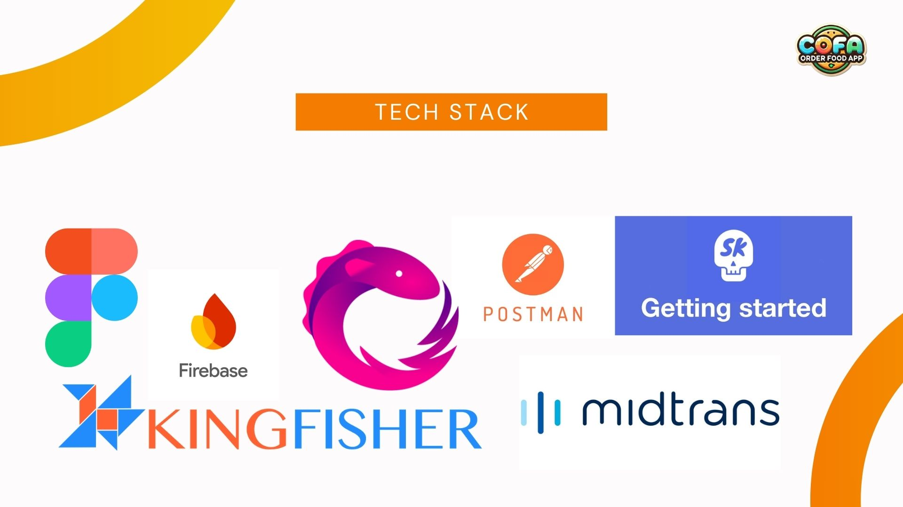

### **Kingfisher**
Kingfisher is a lightweight library for downloading and caching images.
- Use Case: Loading and caching contact profile pictures in the Transfer section.
  
### **RxSwift**
RxSwift enables reactive programming in Swift. It allows the use of Observables, Subjects, and other reactive patterns to manage asynchronous events and data streams.
- Use Case: Binding UI components like buttons and text fields to the ViewModel, handling QR code scanning results, and managing user input validation.
  
### **Firebase**
Firebase is a platform developed by Google that provides a suite of tools and services for building and managing mobile and web applications. It offers cloud-based features that help developers with backend services such as databases, authentication, analytics, and hosting, all of which are easy to integrate and scale.
- Use Case: Authentication: Users can sign up or log in with their Google account using Firebase Authentication.
  
### **Lottie**
Lottie provides animations via JSON files. It allows for rich, scalable animations without impacting performance.
- Use Case: Showing success animations after completing a transaction or top-up.

### **Midtrans**
Midtrans is a payment gateway service that enables businesses to accept online payments. It supports various payment methods, such as credit cards, bank transfers, e-wallets, and payment via convenience stores. Midtrans provides an easy-to-use API for integrating payment processing into websites or mobile apps, making it easier for businesses to handle transactions securely.
- Use Case: Payment Order
  
### **netfox**
Netfox is a network debugging tool that logs all network requests and responses in the app.
- Use Case: Debugging and monitoring all network activity for the application.
  
### **SkeletonView**
SkeletonView provides skeleton loading views that mimic the structure of the UI, providing users with visual feedback during data loading.
- Use Case: Displaying skeleton views while waiting for data like transaction history or profile info to load.
  
### **CoreData**
CoreData is Apple's persistence framework. It stores data locally, such as user contacts or recent transactions, and allows offline access.
- Use Case: Storing contact information and transaction history locally to optimize the app's performance and enable offline access.

### **Toast**
A Toast is a small, non-intrusive message that briefly appears on the screen to inform the user about an action or event. It is typically used to show feedback, such as success or error messages, without interrupting the user's interaction with the app. A Toast usually disappears after a short period (a few seconds) and doesn't require any user interaction to dismiss it.
- Use Case: Get notification after add order to Chart


# Design Patterns
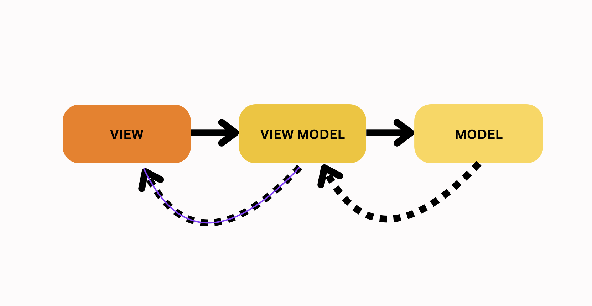

This project adopts the Model-View-ViewModel MVVM separates an app’s user interface (View) from the underlying data (Model) and introduces an intermediary component called ViewModel to manage the presentation logic.

## ScreenShots

| OnBoard | Login | Register |
|--------|--------|---------|
| 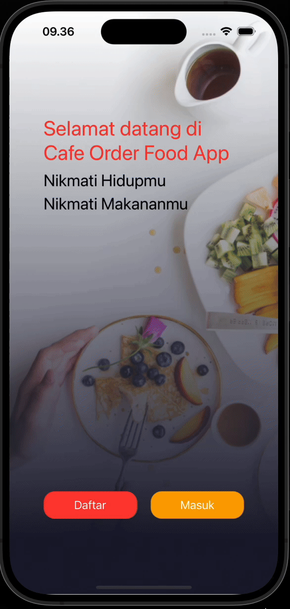 | 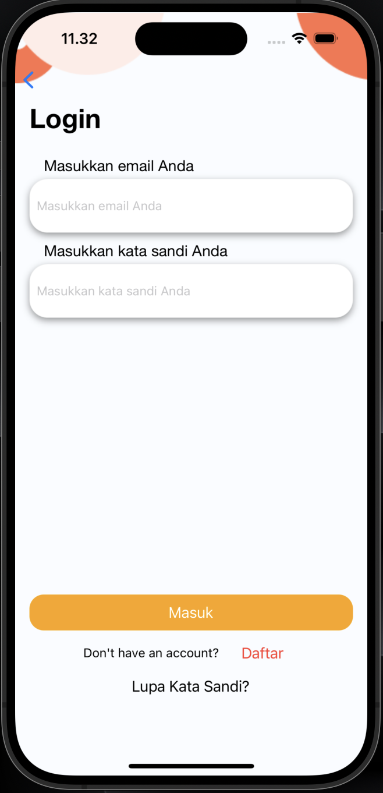 | 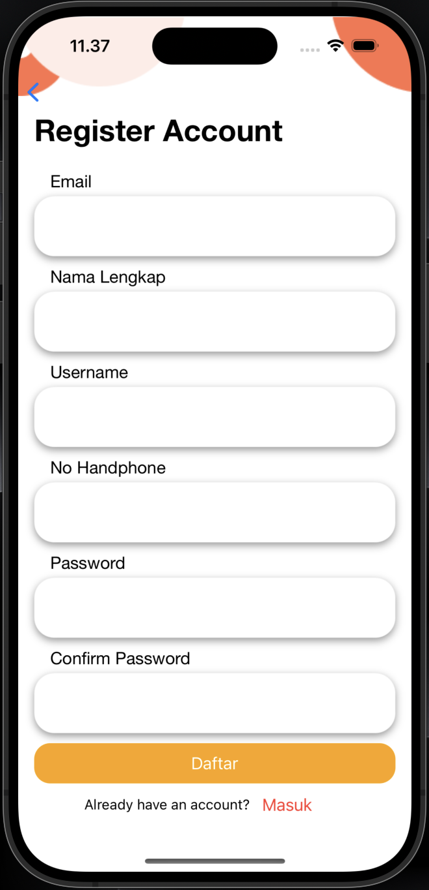 |
| Dashboard | FoodCategory | DetailFood |
|--------|--------|---------|
| 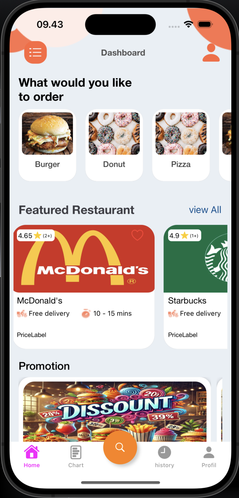 | 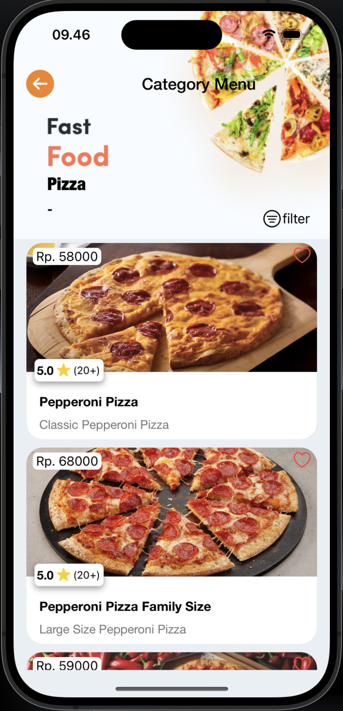 | 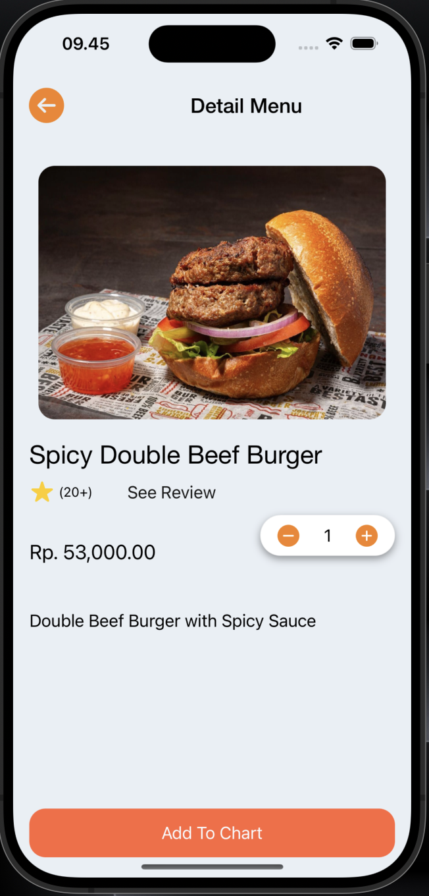 |
| Chart | DetailOrder | Address |
|--------|--------|---------|
| 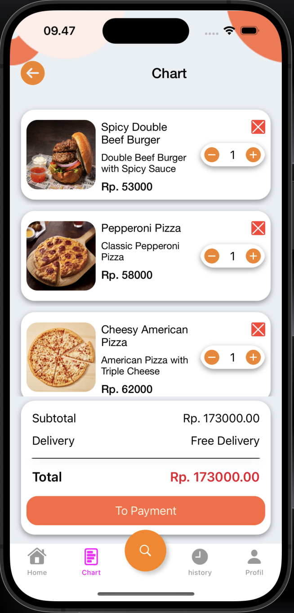 | 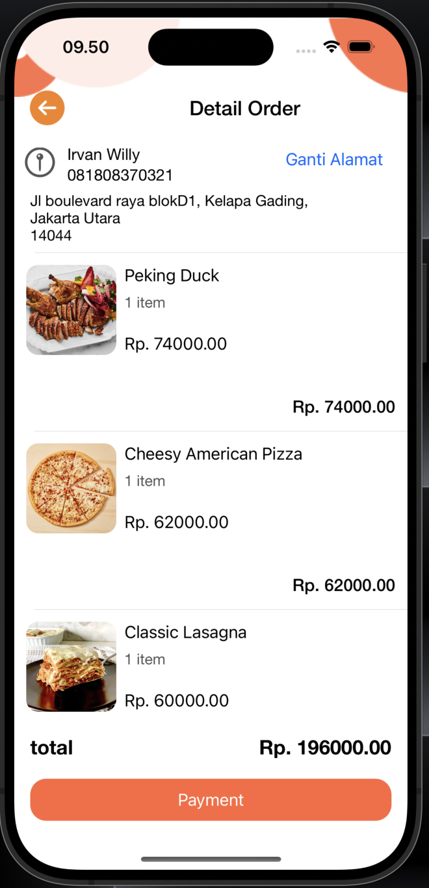 | 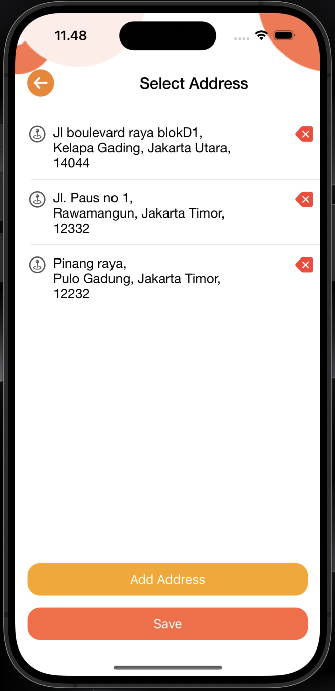 |
| Promo | Payment | Payment |
|--------|--------|---------|
| 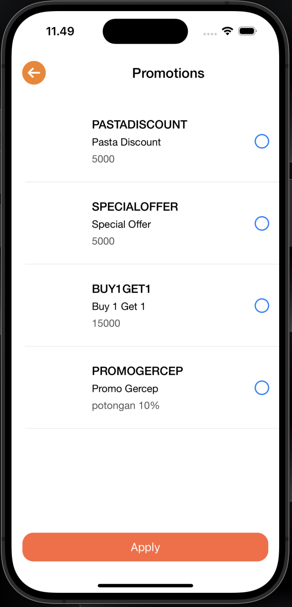 | 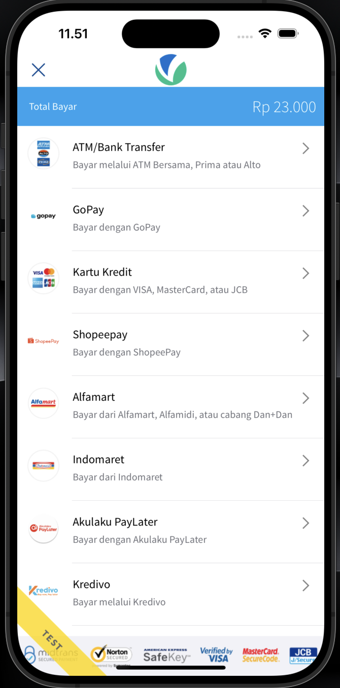 | 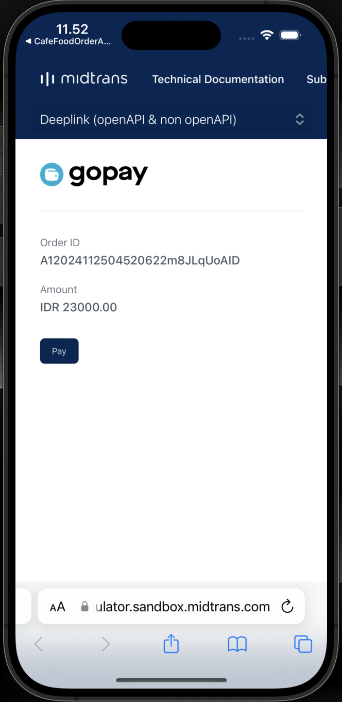 |
| Payment Success | HistoryOrder | DetailHistory Order |
|--------|--------|---------|
| 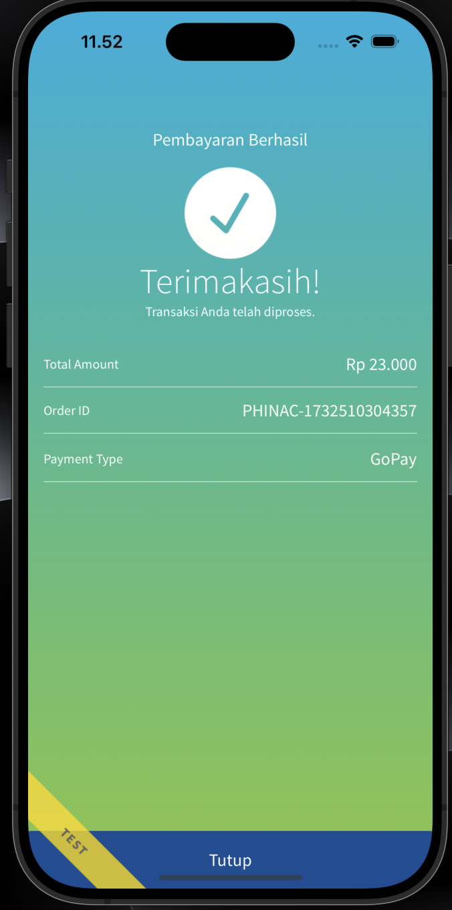 | 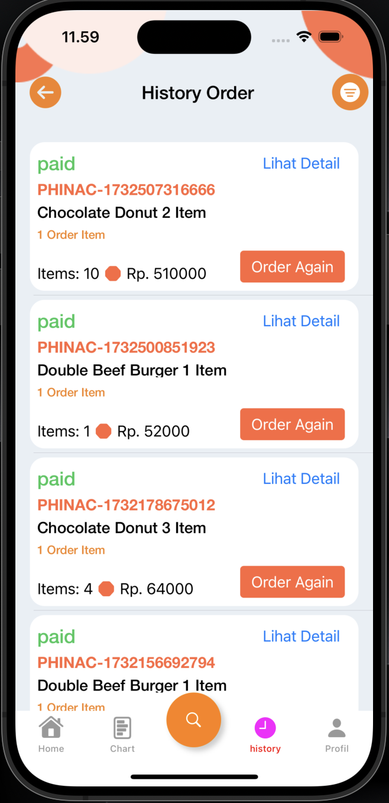 | 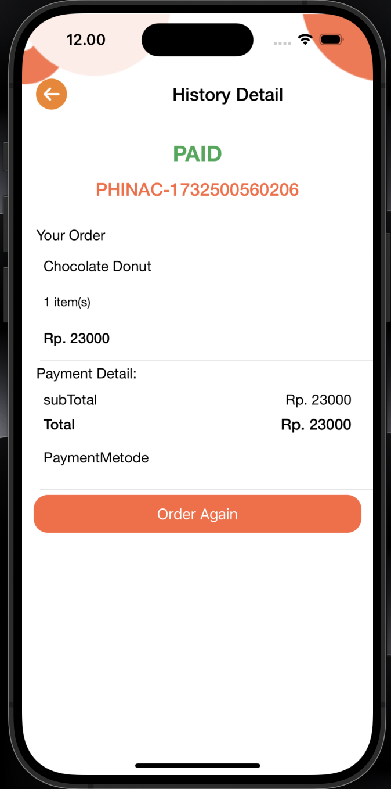 |


# Cafe Order Food App - Project Structure

```
CafeFoodOrderApp
├── CafeFoodOrderApp
│   ├── Coordinator
│   ├── Configuration
│   ├── Resource
│   ├── Network
│   ├── Component
│   │   ├── BottomSheetAddAddress
│   │   ├── BottomSheetReview
│   │   ├── ErrorView
│   │   ├── BottomSheet
│   │   ├── PopUp
│   │   ├── EmptyChart
│   │   ├── ToolBarView
│   │   ├── LeftMenuBottomSheetViewController
│   │   └── CustomInputField
│   ├── Common
│   ├── Module
│   │   ├── FoodReviewViewController
│   │   ├── CancelOrderViewController
│   │   ├── AdsViewController
│   │   ├── PickAddressViewController
│   │   ├── FilterHistoryViewController
│   │   ├── PromotionViewController
│   │   ├── OrderPageViewController
│   │   ├── PaymentMidTransViewController
│   │   ├── HelpCenterViewController
│   │   ├── TermOfServicesViewController
│   │   ├── PrivacyPolicyViewController
│   │   ├── ProfileUserViewController
│   │   ├── ChangeInformationViewController
│   │   ├── MapKitView
│   │   ├── ForgotPassword
│   │   ├── FilterBottomSheet
│   │   ├── ConfirmPaymentViewController
│   │   ├── PaymentViewController
│   │   └── DetailFoodViewController
│   ├── DetailFoodViewController
│   ├── CategoryViewController
│   ├── ProfileViewController
│   ├── HistoryOrderDetailViewController
│   ├── HistoryOrderViewController
│   ├── ChartViewController
│   ├── DashboardViewController
│   ├── MainTabBarController
│   ├── RegisterViewController
│   ├── LoginViewController
│   ├── OnBoard
├── App
│   ├── ViewController
├── Main
├── LaunchScreen
├── Info
├── GoogleService-Info
├── CoreData
├── CafeFoodOrderAppTests
```

# ToDo App

Keep track of tasks, improvements, and future plans for our project.

- [ ] Implement Tracking Order
- [ ] Implement Searching Product
- [ ] Implement Point App
- [ ] Implement Payment with Qris


