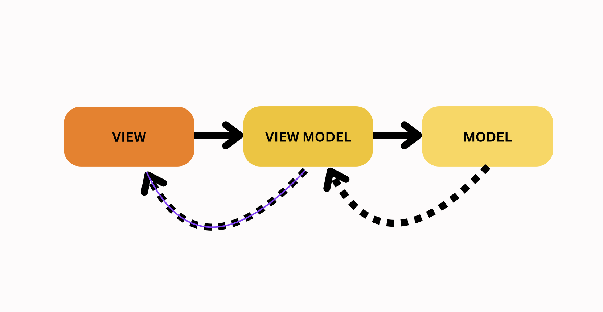
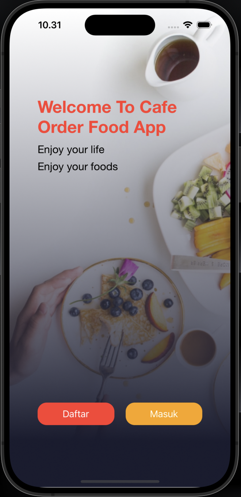

# Cafe Order Food App (COFA)

Welcome to the Cafe Order Food App (COFA), a project designed to showcase a food ordering application. This app allows users to explore the food menu, view item details, and place orders. Its user interface and functionalities are designed to provide an easy and efficient food ordering experience.

<div align="center">
  
  
</div>

## Table of Contents
- [Features](#features)
- [Installation](#installation)
- [Tech Stack](#tech-stack)
- [ScreenShots](#ScreenShots)


## Features
- *Login*: Login to the App.
- *Register*:  Register Account to Login the App.
- *Logout*: Logout from the App.
- *Food Category": Choices from several food categories
- *Food Detail":  Access complete information about each food item, including images.
- *Chart*: Display the selected food
- *Detail Order*: Displays all information about the order before payment
- *Payment*: Make a payment.
- *Add Order*: Add new Order with details like name, category, price, and date.
- *Remove Order*: Remove Order from Chart.
- *History Order*: Can see for History Order.


## Installation

1. *Clone the repository*
   sh
   git clone https://github.com/irvanwilly13/FinalProjectIOS_IrvanWilly

2. *Open the project*
   Open the cloned repository in Xcode.

## Tech Stack


### **Kingfisher**
### **RxSwift**
### **Firebase**
### **IQKeyboardCore**
### **Lottie**
### **Midtrans**
### **netfox**
### **SkeletonView**
### **SnapKit**
### **Toast**


# Design Patterns


This project adopts the Model-View-ViewModel MVVM separates an app’s user interface (View) from the underlying data (Model) and introduces an intermediary component called ViewModel to manage the presentation logic.

## ScreenShots

| OnBoard | Login | Register |
|--------|--------|---------|
|  |  |  |
| Dashboard | FoodCategory | DetailFood |
|--------|--------|---------|
|  |  |  |
| Chart | DetailOrder | Address |
|--------|--------|---------|
|  |  |  |
| Promo | Payment | Payment |
|--------|--------|---------|
|  |  |  |
| Payment Success | HistoryOrder | DetailHistory Order |
|--------|--------|---------|
|  |  |  |


# Cafe Order Food App - Project Structure

```
CafeFoodOrderApp
├── CafeFoodOrderApp
│   ├── Coordinator
│   ├── Configuration
│   ├── Resource
│   ├── Network
│   ├── Component
│   │   ├── BottomSheetAddAddress
│   │   ├── BottomSheetReview
│   │   ├── ErrorView
│   │   ├── BottomSheet
│   │   ├── PopUp
│   │   ├── EmptyChart
│   │   ├── ToolBarView
│   │   ├── LeftMenuBottomSheetViewController
│   │   └── CustomInputField
│   ├── Common
│   ├── Module
│   │   ├── FoodReviewViewController
│   │   ├── CancelOrderViewController
│   │   ├── AdsViewController
│   │   ├── PickAddressViewController
│   │   ├── FilterHistoryViewController
│   │   ├── PromotionViewController
│   │   ├── OrderPageViewController
│   │   ├── PaymentMidTransViewController
│   │   ├── HelpCenterViewController
│   │   ├── TermOfServicesViewController
│   │   ├── PrivacyPolicyViewController
│   │   ├── ProfileUserViewController
│   │   ├── ChangeInformationViewController
│   │   ├── MapKitView
│   │   ├── ForgotPassword
│   │   ├── FilterBottomSheet
│   │   ├── ConfirmPaymentViewController
│   │   ├── PaymentViewController
│   │   └── DetailFoodViewController
│   ├── DetailFoodViewController
│   ├── CategoryViewController
│   ├── ProfileViewController
│   ├── HistoryOrderDetailViewController
│   ├── HistoryOrderViewController
│   ├── ChartViewController
│   ├── DashboardViewController
│   ├── MainTabBarController
│   ├── RegisterViewController
│   ├── LoginViewController
│   ├── OnBoard
├── App
│   ├── ViewController
├── Main
├── LaunchScreen
├── Info
├── GoogleService-Info
├── CoreData
├── CafeFoodOrderAppTests
```

# ToDo App

Keep track of tasks, improvements, and future plans for our project.

- [ ] Implement Tracking Order
- [ ] Implement Searching Product
- [ ] Implement Point App
- [ ] Implement Payment with Qris


