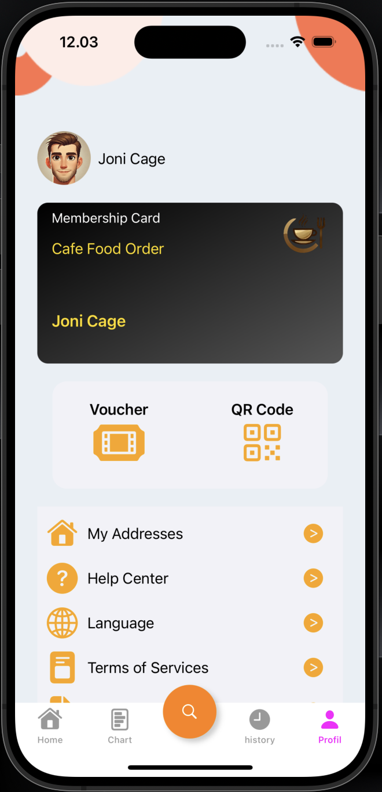

# Cafe Order Food App (COFA)

Welcome to the Cafe Order Food App (COFA), a project designed to showcase a food ordering application. This app allows users to explore the food menu, view item details, and place orders. Its user interface and functionalities are designed to provide an easy and efficient food ordering experience.

  
  

## Table of Contents
- [Features](#features)
- [Installation](#installation)
- [Tech Stack](#tech-stack)
- [ScreenShots](#ScreenShots)

## Features
- *Login*: Login to the App.
- *Register*:  Register Account to Login the App.
- *Logout*: Logout from the App.
- *Food Category": Choices from several food categories
- *Food Detail":  Access complete information about each food item, including images.
- *Chart*: Display the selected food
- *Detail Order*: Displays all information about the order before payment
- *Payment*: Make a payment.
- *Add Order*: Add new Order with details like name, category, price, and date.
- *Remove Order*: Remove Order from Chart.
- *History Order*: Can see for History Order.

## Installation

1. *Clone the repository*
   sh
   git clone https://github.com/irvanwilly13/FinalProjectIOS_IrvanWilly

2. *Open the project*
   Open the cloned repository in Xcode.

## Tech Stack

- *Language*: Swift
- *IDE*: Xcode
- *Framework*: Cocoa (for macOS development)

## ScreenShots

